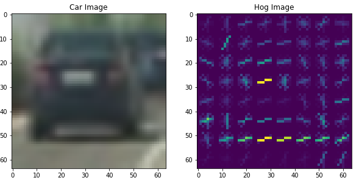
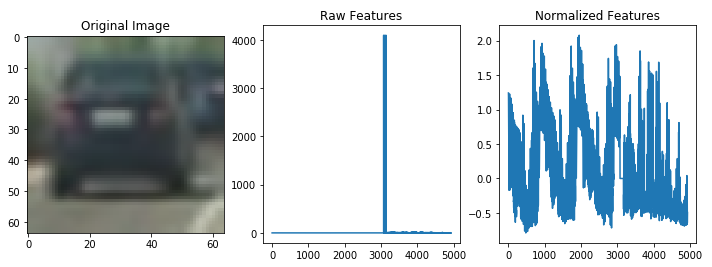
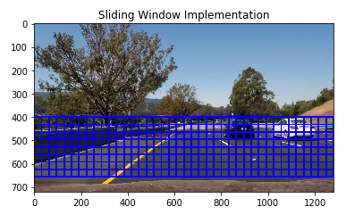
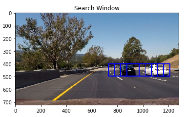
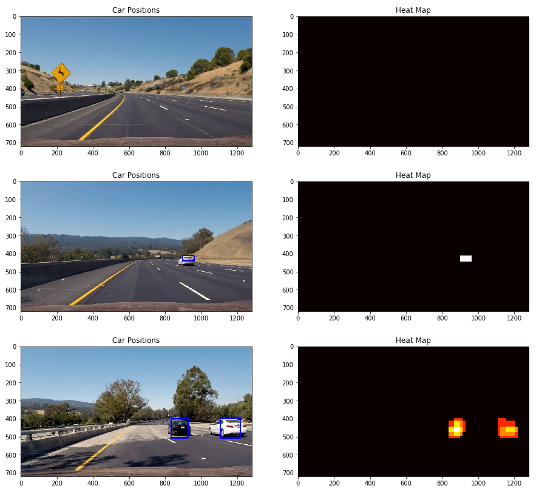

## Writeup Template
### You can use this file as a template for your writeup if you want to submit it as a markdown file, but feel free to use some other method and submit a pdf if you prefer.

---

**Vehicle Detection Project**

The goals / steps of this project are the following:

* Perform a Histogram of Oriented Gradients (HOG) feature extraction on a labeled training set of images and train a classifier Linear SVM classifier
* Optionally, you can also apply a color transform and append binned color features, as well as histograms of color, to your HOG feature vector. 
* Note: for those first two steps don't forget to normalize your features and randomize a selection for training and testing.
* Implement a sliding-window technique and use your trained classifier to search for vehicles in images.
* Run your pipeline on a video stream (start with the test_video.mp4 and later implement on full project_video.mp4) and create a heat map of recurring detections frame by frame to reject outliers and follow detected vehicles.
* Estimate a bounding box for vehicles detected.

[//]: # (Image References)
[image1]: ./examples/car_not_car.png
[image2]: ./examples/HOG_example.jpg
[image3]: ./examples/sliding_windows.jpg
[image4]: ./examples/sliding_window.jpg
[image5]: ./examples/bboxes_and_heat.png
[image6]: ./examples/labels_map.png
[image7]: ./examples/output_bboxes.png
[video1]: ./project_video.mp4

## [Rubric](https://review.udacity.com/#!/rubrics/513/view) Points
### Here I will consider the rubric points individually and describe how I addressed each point in my implementation.  

---
### Writeup / README

### Histogram of Oriented Gradients (HOG)

#### 1. Explain how (and identify where in your code) you extracted HOG features from the training images.

In order to extract HOG features in the images, i've implemented the get_hog_features() function from the class, which by providing parameters like orientation for information split, pixels_per_cell for the cell size, cell_per_block for the normalization we get the expected visualization.

To extract raw and normilzed features from an image i used the extract_features() function and by applying the bin_spatial() function, which computes the binned color features and the color_hist function, which computes the color histogram features, i returned a feature vector and by applying a scaler i extracted the raw and normilzed features of the image.

#### 2. Explain how you settled on your final choice of HOG parameters.

The final parameters used to extract hog features were spatial_size=(32, 32), hist_bins=32, orient = 9, pixels_per_cell = 8 and cell_per_block = 2.

#### 3. Describe how (and identify where in your code) you trained a classifier using your selected HOG features (and color features if you used them).

I trained a linear SVC using the vehicles and non-vihecles images provided with the project, and with that i got a HOG accuracy of 95% and a color accuracy of 95%.

### Sliding Window Search

#### 1. Describe how (and identify where in your code) you implemented a sliding window search.  How did you decide what scales to search and how much to overlap windows?

To create the sliding window technique, i used the slide_window() function provided in class and applied parameters of start and stop position, window size and overlap fraction. I decided to limit the window search area to the bottom half of the image.

#### 2. Show some examples of test images to demonstrate how your pipeline is working.  What did you do to optimize the performance of your classifier?

In order to have the classifier working, i trained the features using the YCrCB channel, an orient of 9, pixel_per_cell of 16, cell_per_block of 4, an ALL hog_channel, a spatial_size of (16,16) and hist_bins of 16. The training with this parameters had a great result of 97.5%.

In order to create the search_window i applied parameters for x and y start/stop positions, window size and overlap fraction of [730, None], [400, 500], (96,96), (0.5,0.5) respectively and the result seem to be fairly good.

Here's an image of the result window:

---

### Video Implementation

#### 1. Provide a link to your final video output.  Your pipeline should perform reasonably well on the entire project video (somewhat wobbly or unstable bounding boxes are ok as long as you are identifying the vehicles most of the time with minimal false positives.)
Here's a [link to my video result](./project_1.mp4)

#### 2. Describe how (and identify where in your code) you implemented some kind of filter for false positives and some method for combining overlapping bounding boxes.

In order to create the final pipeline, after some experimentation with many functions, i've decided to apply another students pipeline as this gave me the best possible results. I used jeremy-shannons code to create it because as he correctly mentions there will be different size and positions in every image so we need to apply different start/stop positions. Here's a link to jeremys code: https://github.com/jeremy-shannon/CarND-Vehicle-Detection/blob/master/vehicle_detection_project.ipynb

### Here are three frames and their corresponding heatmaps:

---

### Discussion

#### 1. Briefly discuss any problems / issues you faced in your implementation of this project.  Where will your pipeline likely fail?  What could you do to make it more robust?

Here I'll talk about the approach I took, what techniques I used, what worked and why, where the pipeline might fail and how I might improve it if I were going to pursue this project further.  

